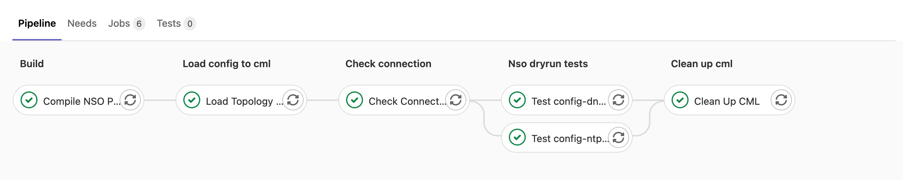
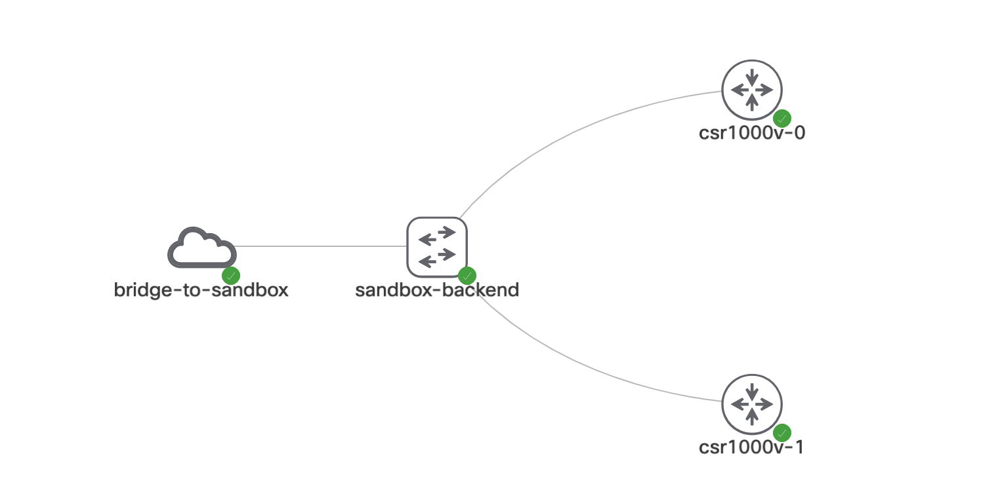

# Get Things Done: A simple NSO Continuous Integration 
In this simple Continuous Integration (CI), we combine
1. Gitlab Community Edition
2. Cisco Modeling Lab (CML)
3. Containerized NSO
4. A simple NSO RESTCONF pytest library

to demonstrate a simple CI chain like this Gitlab Pipeline



In the Gitlab Pipeline, several stages are included,
1. Compile the NSO packages
2. Set up the [devices under test in CML](#sample-cml-view) with given config
3. Use pytest to check the functionality of NSO package in docker containers
4. Clean up everything

Users can follow the setup steps to create a complete CI chain in Devnet Sandbox. The containerized NSO makes testing several NSO packages in parallel possible and the CML creates a full controlled environment for testing. Pytest tests are created based on a NSO testing library to test the dryrun of the NSO package.

# Demo Setup Steps:
1. Reserve an instance of the [Devnet CML Sandbox](https://devnetsandbox.cisco.com/RM/Diagram/Index/45100600-b413-4471-b28e-b014eb824555?diagramType=Topology), an email with how to set up VPN to the Sandbox will be sent 

2. Follow the instruction in the email to set up VPN. After connecting to Devnet sandbox VPN, ssh to Dev Server (password: C1sco12345)
   ```
   ssh developer@10.10.20.50
   ```

3. Clone this project
   ```
   git clone --recurse-submodules https://github.com/wholechainsawit/devnet-gitlab-nso-cml-ci.git
   ```

4. Download trial NSO from [Devnet Download](https://developer.cisco.com/fileMedia/download/da6e8ed4-0b65-357a-9cf3-c1b3357a2ad4/) and get the unsigned `nso-5.3.linux.x86_64.installer.bin` by executing
   ```
   bash nso-5.3.linux.x86_64.signed.bin
   ```
   Copy the trial NSO to the Dev Server (password: C1sco12345)
   ```
   scp nso-5.3.linux.x86_64.installer.bin developer@10.10.20.50:/home/developer/devnet-gitlab-nso-cml-ci/setup/nso-docker/nso-install-files
   ```

5. Run setup script
   ```
   cd /home/developer/devnet-gitlab-nso-cml-ci/setup
   sh set-env.sh
   ```

6. Setup a new project in Gitlab
   1. Create a new project, nso_cicd, on Gitlab [Instructions](https://developer.cisco.com/learning/lab/nso-cicd/step/4)
   2. Add this project to the Gitlab
       ```
       cd /home/developer/devnet-gitlab-nso-cml-ci
       git remote add gitlab http://10.10.20.50/root/nso_cicd.git
       git push -u gitlab --all
       Username for 'http://10.10.20.50': root
       Password for 'http://root@10.10.20.50': C1sco12345
       ```
7. That's it! Enjoy!

# Sample CML View
* Network topology in CML while running the CI


# Reference:
[Devnet Learning lab - NSO in a CI/CD Pipeline](https://developer.cisco.com/learning/lab/nso-cicd/step/1)
[NSO in Docker](https://github.com/NSO-developer/nso-docker)
[A GTD NSO RESTCONF library](https://github.com/wholechainsawit/nso_test_restconf)
[Hand-on with NetDevOps](https://github.com/juliogomez/netdevops)

### Devnet Sandbox devices info
```
Dev Server: developer@10.10.20.50 developer/C1sco12345
CML: https://10.10.20.161  developer/C1sco12345
```

# Acknowledgements
Special thanks to Damiano, Asad, and Dan from Verizon team for their support of this project.
